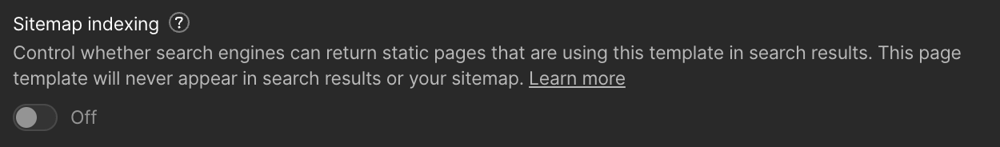
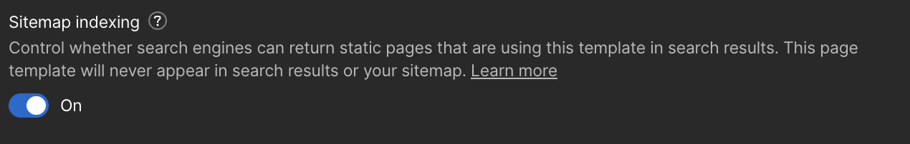
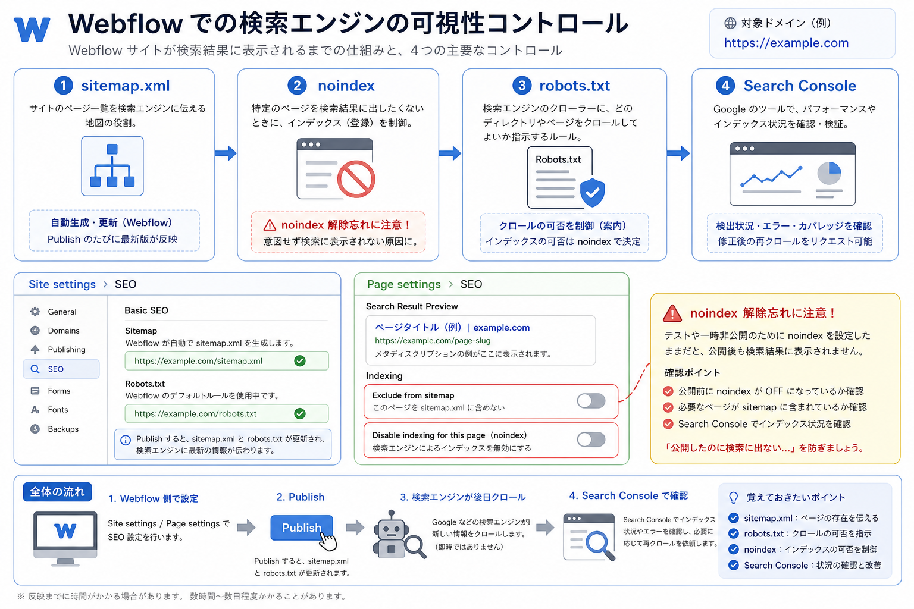

<!-- body-callout:start -->
:::caution[作業前に止まるポイント]
削除、復元、非公開、公開設定、Designer操作は影響が大きい作業です。実行ボタンを押す前に、対象ページ名、対象アイテム、公開先をもう一度確認してください。迷う場合は作業を止めて担当者へ共有します。
:::
<!-- body-callout:end -->

「特定のページは Google の検索結果に出したくない」「サイト全体のページ一覧を Google に正しく伝えたい」といった、検索エンジンとの付き合い方の基本設定です。

---

## 1. 知っておくべき2つの仕組み

| 用語 | 役割 | 設定場所 |
|---|---|---|
| <strong>sitemap.xml</strong> | サイト内の全ページ一覧を検索エンジンに伝える | 自動生成（基本は触らない） |
| <strong>noindex</strong> | 「このページは検索結果に出さないで」と指示 | ページごとの設定 |

## 2. sitemap.xml の確認

Webflow は <strong>sitemap.xml を自動生成</strong> します。確認するには：

1. 自社サイトの URL の末尾に `/sitemap.xml` を付けてアクセス
   - 例: `https://example.com/sitemap.xml`
2. XML 形式でサイトの全ページが一覧表示されればOK

### Google Search Console への登録

サイトを Google に効率的にインデックスしてもらうため、Search Console に sitemap を登録することが推奨されます。これは <strong>制作担当者が初期セットアップ</strong> していますが、確認したい場合：

1. Google Search Console にログイン
2. 左メニュー「Sitemap」を開く
3. `sitemap.xml` が登録されているか確認

## 3. ページごとに「検索結果に出さない」設定（noindex）

特定ページを検索結果に出したくない場合：

### 個別ページの場合（Designer）

1. Designer モードを開く
2. 対象ページの <strong>Page Settings</strong>（歯車アイコン）を開く
3. <strong>「Indexing」</strong> または <strong>「Search settings」</strong> セクションを確認
4. <strong>「Disable indexing for this page」</strong> または <strong>「Exclude from sitemap.xml」</strong> をON
5. <strong>Publish</strong> で反映

*実画面例: Sitemap indexingをOffにすると、そのテンプレートページは検索結果やsitemap.xmlに出ない状態になります。*

*実画面例: 通常公開したいページでは、Sitemap indexingがOnになっているか確認します。*

:::caution[noindex解除忘れに注意]
noindexは検索結果からページを外すための設定です。キャンペーン終了後やテストページだけに使い、通常の会社概要・サービス・ブログ記事には設定しないでください。
:::

### サイト全体を一時的に非公開にする場合

サイトリニューアル中など、<strong>サイト全体を検索結果から外したい時</strong>：

1. Project Settings → <strong>「SEO」</strong> タブを開く
   サイト全体の検索エンジン関連設定は、Site settingsのSEOから確認します。

2. <strong>「Disable Webflow subdomain indexing」</strong> をON
3. <strong>Publish</strong>

> <strong>注意</strong>: サイト全体の noindex は <strong>解除を忘れると検索結果に永遠に出ません</strong>。リニューアル後の解除を必ず確認してください。

## 4. robots.txt について

`robots.txt` は検索エンジン（クローラー）への指示ファイルです。Webflow は <strong>基本的なrobots.txt を自動生成</strong> しています。

URLの末尾に `/robots.txt` を付けて確認できます：
- 例: `https://example.com/robots.txt`

カスタマイズが必要な場合は [IGNITE公式サイトのお問い合わせフォーム](https://igni7e.jp/contact/) から依頼してください。クライアント側での編集は推奨されません。
Custom codeは専門的な設定です。SEOタグや計測タグに関係することがあるため、通常は制作担当者に依頼してください。

## 5. よくある「noindex」を使う場面

- <strong>サンクスページ</strong>（フォーム送信完了画面）
- <strong>テスト用ページ</strong>
- <strong>会員限定ページ</strong>
- <strong>キャンペーン終了後のページ</strong>

逆に、<strong>通常の自社紹介ページや商品ページ・ブログ記事は noindex にしない</strong> でください。SEO 的な機会損失になります。

## 6. よくある質問 (Q&A)

#### Q. noindex を設定したら、すぐに検索結果から消えますか？

いいえ、Google が再クロールして反映するまで <strong>数日〜数週間</strong> かかります。緊急性がある場合は Google Search Console の「URL の削除」機能も併用してください。

#### Q. sitemap.xml に新しい記事がすぐ載りません。

Webflow は通常 <strong>公開時に sitemap.xml を自動更新</strong> します。反映されない場合は Project Settings → SEO で sitemap の再生成を試してください。

#### Q. 「特定のページだけ Google に表示させたい」という設定はありますか？

それは Webflow 側ではなく <strong>検索エンジン側の挙動</strong> です。コンテンツの質と被リンクで決まるため、SEO 対策（記事の充実、内部リンクなど）が必要になります。

---

<strong>次のステップ:</strong>
これで便利な設定編は完了です。次はトラブル解決編へ進みましょう → 「変更を保存したのに、サイトに反映されません！」

:::note[図解の見方]
noindex解除忘れは重大なので必ず記録します。
:::
