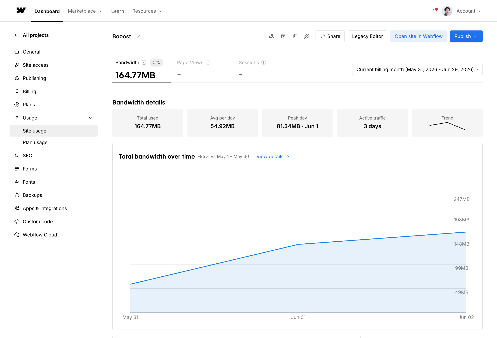

<!-- body-callout:start -->
:::caution[料金・上限に関わる確認]
Site usageは、サイトのBandwidth使用量を確認する画面です。上限はSite planによって変わるため、数値だけで判断せず、必要に応じて社内管理者または制作担当者に確認してください。
:::
<!-- body-callout:end -->

Webflowでは、公開サイトで読み込まれる画像、動画、PDF、HTML、CSS、JavaScriptなどがBandwidthを使います。Bandwidthは「サイトを見る人にデータを配信した量」と考えると分かりやすいです。

画像をたくさん使うページや、大きな画像・動画・PDFを置いているページは、表示速度だけでなくSite usageにも影響します。

## 1. Site usageで見る場所

Site usageは、Site settingsの中から確認します。

1. Webflow Dashboardで対象サイトを開きます。
2. Site settingsを開きます。
3. 左メニューの `Usage` を開きます。
4. `Site usage` を選びます。
5. `Bandwidth` の使用量と、対象期間を確認します。

画面上では、月ごとの合計、1日あたりの平均、使用量の推移などを確認できます。数字が急に増えている場合は、大きな画像、動画、PDF、またはアクセス増加が原因になっていることがあります。

:::note[プランによって上限が変わります]
Bandwidthの上限はSite planごとに異なります。Basic、CMS、Businessなどのプランや、将来のWebflow側の変更によって条件が変わるため、マニュアル上では固定の上限値を覚えるより、Site usage画面で確認することを優先してください。
:::

## 2. 大きいAssetが増えると起きること

画像、動画、PDFなどのAssetが大きいと、次のような問題につながります。

| 起きること | 影響 |
|---|---|
| 画像アップロードに失敗する | Webflowのアップロード上限に引っかかることがあります |
| ページ表示が遅くなる | ユーザーがページを離れやすくなります |
| Bandwidth使用量が増える | Site planの上限確認が必要になることがあります |
| スマートフォンで重くなる | 通信量が増え、表示待ちが長くなります |

## 3. 画像を入れる前にやること

通常の写真やブログ画像は、アップロード前に圧縮してから使います。

- 写真は必要以上に大きいピクセルサイズのまま使わない。
- 1枚あたり500KB前後を目安に、できるだけ軽くする。
- Webflowの画像アップロード上限を超えないようにする。
- ロゴやアイコンは、用途に合わせてSVG、PNG、WebPなどを選ぶ。
- 使っていない古いAssetは、削除してよいか制作担当者に確認する。

圧縮には、Squoosh、TinyPNG、Photoshopなどを使えます。画質が荒くなりすぎない範囲で、ファイルサイズを小さくしてください。

:::tip[迷った時の目安]
見た目がほとんど変わらないのにファイルサイズが大きい画像は、圧縮の効果が出やすいです。特にカメラやスマートフォンで撮った写真をそのまま使う場合は、先に圧縮しましょう。
:::

## 4. 使用量が多い時の相談先

Site usageでBandwidthが増えている、またはWebflowから使用量に関する通知が来た場合は、自己判断でプラン変更やAsset削除をしないでください。

相談時は、次の情報を共有すると確認が早くなります。

- Site usage画面のスクリーンショット
- 対象期間
- 最近追加した画像、動画、PDFの有無
- 最近アクセスが増えたページ
- Webflowから届いた通知メールの内容

## 5. 公式情報

Webflowの仕様や上限は変わることがあります。最新情報は公式ヘルプも確認してください。

- [Bandwidth overview](https://help.webflow.com/hc/en-us/articles/33961410031507-Bandwidth-overview)
- [Assets panel](https://help.webflow.com/hc/en-us/articles/33961269934227-Assets-panel)
- [Responsive images](https://help.webflow.com/hc/en-us/articles/33961378697107-Responsive-images)

## 次に進む

画像アップロードでエラーが出ている場合は [「画像がアップロードできません！」原因と対処法](/06-troubleshooting/02-image-upload-failed/) を確認してください。
