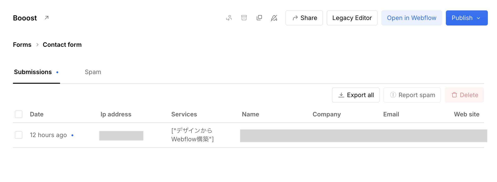

<!-- body-callout:start -->
:::note[個人情報の取り扱い]
フォーム送信内容や通知先メールアドレスには個人情報が含まれることがあります。画面共有やキャプチャーを送る時は、氏名、メールアドレス、問い合わせ本文が必要以上に写らないようにしてください。
:::
<!-- body-callout:end -->

> 新規追加（標準スコープ補完）

「お問い合わせフォームから送信されたはずなのに、通知メールが届かない」というトラブルはよく発生します。多くの場合、<strong>迷惑メール判定</strong> か <strong>SPF/DKIM 認証の設定</strong> が原因です。
*実画面例: 通知メールの確認は、対象サイトのForms画面から始めます。*

---

## 1. まず確認すべき4つのポイント

### ① Webflow 管理画面で送信記録を確認

1. Webflow にログイン → 対象サイト → <strong>Forms</strong> タブを開く
2. 送信記録（Submissions）に <strong>問い合わせがリストアップされているか</strong> を確認
3. <strong>記録あり</strong> → 送信は成功 → メール配信側の問題
4. <strong>記録なし</strong> → フォーム自体が機能していない可能性

### ② 通知先メールアドレスの確認

1. Project Settings → <strong>「Forms」</strong> タブを開く
2. <strong>「Send form submissions to」</strong> に正しいメールアドレスが入っているか確認
3. タイプミス（カンマや余分な空白）がないか目視チェック

### ③ 迷惑メールフォルダを確認

通知メールの送信元は `no-reply@webflow.com` 等になることが多く、<strong>迷惑メール判定されやすい</strong> です。

1. Gmail / Outlook の <strong>迷惑メール（スパム）</strong> フォルダを開く
2. Webflow からのメールがあれば、<strong>「迷惑メールではない」</strong> ボタンで戻す
3. 送信元を <strong>連絡先（Contacts）に追加</strong> すると今後の判定が緩くなる

### ④ メールフィルタ・転送設定を確認

社内のメールサーバーやセキュリティソフトが、外部メールをブロックしている可能性があります。情シス担当者に <strong>`webflow.com` ドメインからのメール許可</strong> を依頼してください。

## 2. SPF/DKIM の設定（恒久対応）

迷惑メール判定を <strong>根本的に防ぐ</strong> には、ドメイン側で SPF/DKIM の設定をすることが推奨されます。

> <strong>注意</strong>: これは <strong>DNS 設定の変更</strong> を伴うため、[IGNITE公式サイトのお問い合わせフォーム](https://igni7e.jp/contact/) から依頼してください。クライアント側で操作するとサイトやメールが止まるリスクがあります。

### SPF とは？

「このドメインからのメールを送る権限を持つサーバー」を宣言する仕組み。これにより受信側が「正しい送信元か」を判断できます。

### DKIM とは？

メールに <strong>デジタル署名</strong> を付けることで「改ざんされていない」ことを証明する仕組み。Gmail などは DKIM 未設定のメールを迷惑メール扱いしやすくなっています。

## 3. Zapier などで二重通知を仕掛ける（強力な対策）

メールに依存しない通知を入れることで、<strong>メールが届かなくても問い合わせを見逃さない</strong> 仕組みが作れます。

代表例:
- <strong>Zapier × Slack</strong>: 問い合わせがあったら Slack の指定チャンネルに通知
- <strong>Zapier × Google Sheets</strong>: 問い合わせ内容を自動で Google Sheets に記録
- <strong>Webhook</strong>: 制作担当者が独自の通知システムを構築

> <strong>ヒント</strong>: 上記は <strong>追加実装が必要</strong> です。導入を検討する場合は [IGNITE公式サイトのお問い合わせフォーム](https://igni7e.jp/contact/) からご相談ください。

## 4. 一時的な対処法

恒久対応までの繋ぎとして、<strong>Webflow 管理画面の Forms タブを毎日チェックする</strong> 運用にしましょう。

- 朝の業務開始時にチェック
- 夕方の業務終了時にもう一度チェック
- 重要な問い合わせは見逃さない

## 5. よくある質問 (Q&A)

#### Q. 昨日まで届いていたのに、今日から急に届きません。

<strong>メールサーバー側の設定変更</strong> または <strong>Webflow 側の送信元IP変更</strong> が原因の可能性があります。まず Webflow 管理画面で送信記録があるかを確認し、なければフォームの設定を、あればメール側の問題として情シスに相談してください。

#### Q. 通知メールアドレスを複数設定したいです。

Project Settings → Forms で <strong>カンマ区切り</strong> で複数のアドレスを入力できます。例: `info@example.com, sales@example.com`

#### Q. すべての対策をしたのに届きません。

[IGNITE公式サイトのお問い合わせフォーム](https://igni7e.jp/contact/) からご連絡ください。SPF/DKIM の設定確認、または Zapier 等での代替通知の実装を検討します。

---

<strong>次のステップ:</strong>
これでトラブル解決編は完了です。マニュアル全体を一通り学んだあとは、実際に Webflow を触って練習してみてください。困ったらいつでもこのマニュアルに戻ってきましょう。
