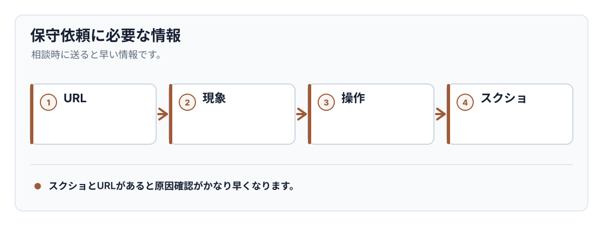

<!-- body-callout:start -->
:::tip[問い合わせ前の準備]
トラブル時は、対象URL、起きている現象、試した操作、スクリーンショットをまとめておくと原因確認が早くなります。保守契約済みの場合はGoogle Chatまたは担当者へ共有してください。
:::
<!-- body-callout:end -->

このマニュアルは、Webflowサイトを自社で安全に更新できるようにするための手順書です。ただし、すべてを自社で対応する必要はありません。

「画面を触るのが不安」「表示崩れが怖い」「本業が忙しく、更新に時間をかけたくない」という場合は、IGNITEへ保守・補修を依頼できます。
*実画面例: 保守依頼では、どの画面で困っているかが分かるキャプチャーを一緒に送ると対応が早くなります。*

> <strong>保守契約済みの方</strong>: すでにIGNITEと保守契約を結んでいる場合は、問い合わせフォームではなく、通常の保守連絡としてGoogle Chat、または担当者へ直接ご連絡ください。

> <strong>未契約・新規相談の方</strong>: まだ保守契約がない場合や、初めて相談する場合は [IGNITE公式サイトのお問い合わせフォーム](https://igni7e.jp/contact/) からご連絡ください。

> <strong>目安</strong>: EF / EFG など、お客様側で補修依頼が発生した場合も、まずは対象URL・やりたいこと・スクリーンショットをまとめて共有してください。保守契約済みの場合はGoogle Chatまたは担当者へ、未契約の場合は問い合わせフォームから送ってください。

---

## 1. 自分で対応するか、依頼するかの判断基準

| 状況 | おすすめ |
| --- | --- |
| 誤字を1箇所だけ直したい | マニュアルを見ながら自社対応 |
| ブログ記事やお知らせを追加したい | 慣れていれば自社対応、不安なら依頼 |
| トップページや固定ページのレイアウトを触る必要がある | 依頼を推奨 |
| スマートフォンだけ表示が崩れている | 依頼を推奨 |
| フォーム、通知メール、ドメイン、公開設定を変更したい | 事前相談を推奨 |
| 何を押せばよいか分からない | 作業を止めて相談 |

Webflowは直感的に操作できますが、Designerや設定画面を誤って変更すると、表示崩れ・フォーム不具合・公開ミスにつながることがあります。

## 2. IGNITEに依頼できる主な内容

保守・補修では、既存サイトを安全に運用するための軽微な修正やサポートに対応します。

| 分類 | 内容の例 |
| --- | --- |
| 表示・レイアウト修正 | 余白、整列、モバイル表示崩れの調整 |
| 画像差し替え | 既存画像の差し替え、サイズ調整、軽い最適化 |
| テキスト・リンク修正 | 誤字修正、文言変更、リンク先URLの変更 |
| 表示崩れの調査・復旧 | 原因確認、復旧作業、再発防止の確認 |
| 操作方法のサポート | Webflowの操作案内、編集手順の説明 |
| CMS投稿支援 | お知らせ・ブログ記事の追加、既存記事の編集 |
| CMSの軽微な変更 | 既存テンプレートの範囲内での項目名変更や軽微な調整 |
| PDFアップロード | PDFファイルのアップロード、ボタンやテキストからのリンク設置 |
| フォームの微修正 | 項目の追加・変更、通知先メールアドレス変更 |
| バックアップ確認 | 必要に応じたバックアップ確認や復旧相談 |

## 3. 別途見積もりになりやすい内容

次のような作業は、保守の範囲を超えることが多いため、別途見積もりになります。

| 分類 | 内容の例 |
| --- | --- |
| 新規バナー制作 | 新しいデザイン作業が発生するビジュアル制作 |
| 固定ページの新規追加 | 会社概要、採用情報、サービスページなどの新規設計・構築 |
| スライダー構造の変更 | 枚数追加、構造変更、表示ロジックの変更 |
| 新規アニメーション実装 | スクロール演出、パララックス、新しい動きの追加 |
| 新機能追加 | API連携、会員機能、問い合わせ管理など |

大きな変更かどうか分からない場合は、まず「やりたいこと」をそのまま共有してください。対応範囲か、別途見積もりかを確認します。

## 4. 保守プランの目安

公開用の保守プランの目安は以下です。正式な契約条件や対応開始日は個別のご案内を優先します。

| プラン | 目安金額 | 主な内容 |
| --- | --- | --- |
| 保守プランなし | 都度見積もり | 必要な時だけ個別に相談 |
| Webflow保守プラン | 22,000円/月（税込） | メール・チャット・電話でのやり取り、操作ミスによる修正対応の目安4時間/月、Webflow操作質問、コンテンツ更新サポート |

> <strong>料金について</strong>: 税抜価格は20,000円/月、税込価格は22,000円/月です。修正時間は月ごとにリセットされます。大幅な修正、追加開発、デザイン制作、外部連携などは別途相談となります。Webflowアカウントやプランの月額費用は、原則としてお客様側のご負担です。

## 5. 依頼時に送る情報

次の情報をまとめて送ると、確認と見積もりがスムーズです。

- 対象ページのURL
- 直したい箇所のスクリーンショット
- 変更したい文章、画像、リンク先URL
- 希望公開日
- 自社で途中まで作業した場合は、どこまで触ったか
- エラーが出ている場合は、エラー文と表示されたタイミング

## 6. 依頼した方が早いケース

次のような場合は、マニュアルを読みながら時間をかけるより、最初から依頼した方が早く安全です。

- 公開中サイトの見た目が崩れていて、すぐ直したい
- スマートフォンだけ表示がおかしい
- WebflowのDesigner画面で何を選択しているか分からない
- フォームや通知メールが関係する
- 社内確認や公開期限が近い
- 変更範囲が複数ページにまたがる

迷った場合は、作業を止めてIGNITEへ相談してください。保守契約済みの方はGoogle Chatまたは担当者へ、未契約・新規相談の方は [IGNITE公式サイトのお問い合わせフォーム](https://igni7e.jp/contact/) からご連絡ください。無理に操作を続けるより、状況が分かる段階で共有する方が復旧しやすくなります。

## 7. お問い合わせ先

保守契約済みの方は、問い合わせフォームではなく、通常の保守連絡としてGoogle Chat、または担当者へ直接ご連絡ください。

まだ保守契約がない場合や、初めて相談する場合は [IGNITE公式サイトのお問い合わせフォーム](https://igni7e.jp/contact/) からご連絡ください。フォームには、対象サイトURL、困っている内容、希望公開日、スクリーンショットの有無を記載すると確認がスムーズです。

:::note[図解の見方]
スクショとURLがあると原因確認がかなり早くなります。
:::

