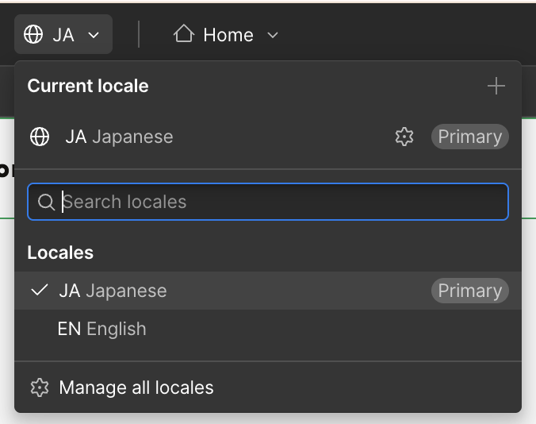

<!-- body-callout:start -->
:::caution[Locale確認]
翻訳作業では、今どのLocaleを編集しているかを最初に確認します。日本語、英語などのLocaleを間違えると、意図しない言語ページを書き換える可能性があります。
:::
<!-- body-callout:end -->

# E-2. Locale翻訳の基本手順

Locale翻訳では、最初に「どの言語を編集しているか」を確認することが最も重要です。別のLocaleを選んだまま編集すると、意図しない言語の内容を変更してしまうことがあります。
*実画面例: Locale翻訳では、ページの見た目だけでなく、現在選択しているLocaleも確認します。*

## 作業の流れ

1. Webflowにログインし、対象サイトをDesignerで開きます。
2. 画面上部のLocale selector、またはSettings panelのLocalizationから対象Localeを確認します。
3. 修正したいSecondary localeを選びます。
4. 静的ページ、CMS item、SEO設定など、翻訳したい場所を開きます。
5. 必要に応じてWebflowの機械翻訳を使います。
6. 翻訳結果を人の目で確認し、不自然な表現を直します。
7. PC表示とスマートフォン表示を確認します。
8. 必要なLocaleとドメインを選んでPublishします。
9. 公開後、実際のLocale URLで確認します。

## 翻訳前に確認すること

- Primary localeの内容が最新か
- 編集するSecondary localeが正しいか
- 翻訳対象が静的ページかCMSかSEOか
- 既に手動修正済みの翻訳を上書きしないか
- Publishしてよいタイミングか

## 機械翻訳を使う時の考え方

機械翻訳は最初のたたき台として便利です。ただし、公開前に必ず人の目で確認してください。

特に確認するもの:

- 固有名詞
- 商品名・サービス名
- 専門用語
- ボタン文言
- 問い合わせ導線
- 価格や日付
- 法務・医療・採用など誤訳リスクが高い文章

## 翻訳後に起きやすい問題

| 症状 | 原因 | 対応 |
| --- | --- | --- |
| ボタン文字がはみ出す | 翻訳後に文章が長くなった | 文言を短くするか、レイアウト調整を依頼 |
| 一部だけ原文のまま | 未翻訳フィールドが残っている | ページ、CMS、SEOを順番に確認 |
| 公開サイトに出ない | 対象LocaleがPublishされていない | Publishing statusと公開対象を確認 |
| URLが想定と違う | SubdirectoryやSlug設定の影響 | 自己判断で変更せず相談 |

## 次に進む

まだ対象Localeが用意されていない場合は [新しいLocaleを追加する時の流れ](/07-localization/06-add-new-locale/) を確認してください。固定ページを翻訳する場合は [静的ページをLocaleごとに翻訳する](/07-localization/02-static-page-translation/) を確認してください。
