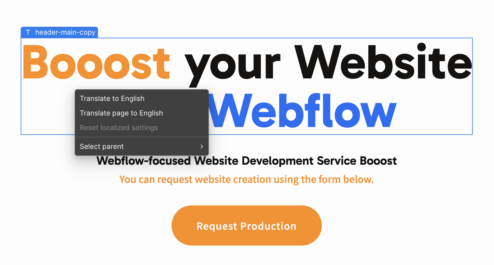
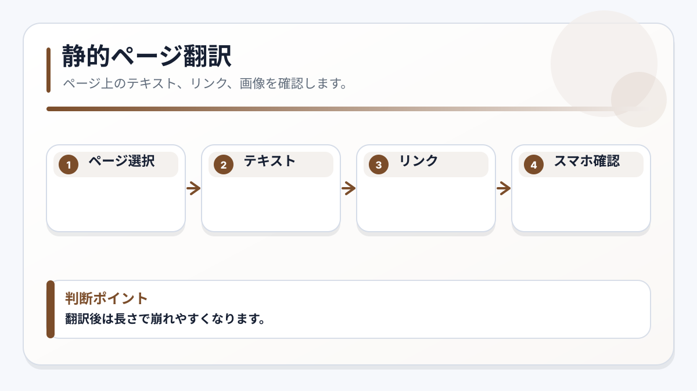

<!-- body-callout:start -->
:::caution[Locale確認]
翻訳作業では、今どのLocaleを編集しているかを最初に確認します。日本語、英語などのLocaleを間違えると、意図しない言語ページを書き換える可能性があります。
:::
<!-- body-callout:end -->

# E-4. 静的ページをLocaleごとに翻訳する

:::note[図解の見方]
翻訳後は長さで崩れやすくなります。
:::

トップページ、会社概要、サービスページのような固定ページは、対象Localeに切り替えてからページ上のテキストや画像を修正します。
*実画面例: 固定ページ翻訳では、見出し、本文、ボタン、ナビゲーションの文言を順番に確認します。*

## 作業手順

1. Designerで対象ページを開きます。
2. Locale selectorで翻訳したいLocaleを選びます。
3. 翻訳したいテキストを選択します。
4. 機械翻訳を使う、または手動で翻訳文を入力します。
5. 見出し、本文、ボタン、リンクを確認します。
6. 画像やaltテキストもLocaleに合っているか確認します。
7. PC表示とスマートフォン表示を確認します。

## 確認する場所

- ヒーロー見出し
- セクション見出し
- 本文
- ボタン文言
- リンク先
- 画像
- 画像altテキスト
- フッターやヘッダーなど共通パーツ

## 画像・リンクの注意

翻訳では文章だけでなく、画像やリンクもLocaleに合わせることがあります。

例:

- 日本語ページでは日本語資料PDFへリンクする
- 英語ページでは英語資料PDFへリンクする
- 地域ごとに問い合わせ先を変える
- 画像内に文字がある場合、画像も翻訳版に差し替える

## やってはいけないこと

- Localeを確認せずに文章を変更する
- Primary localeの共通パーツを不用意に変更する
- ボタン文字がはみ出したままPublishする
- 翻訳前のリンク先を確認せず公開する

## 次に進む

ブログやお知らせを翻訳する場合は [CMS記事をLocaleごとに翻訳する](/07-localization/03-cms-locale-translation/) を確認してください。
