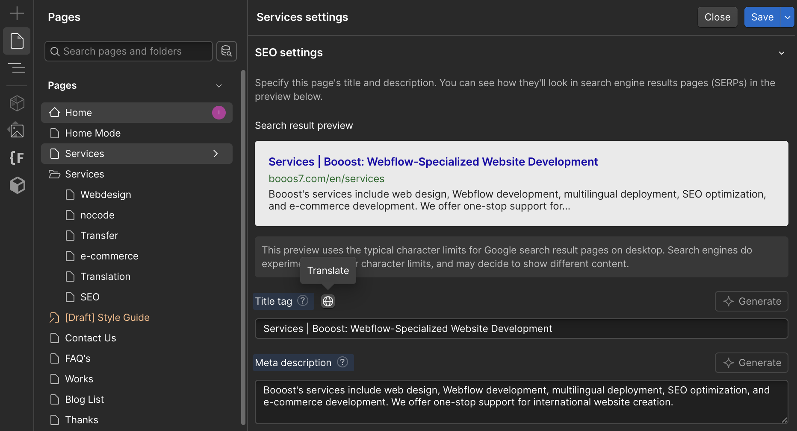
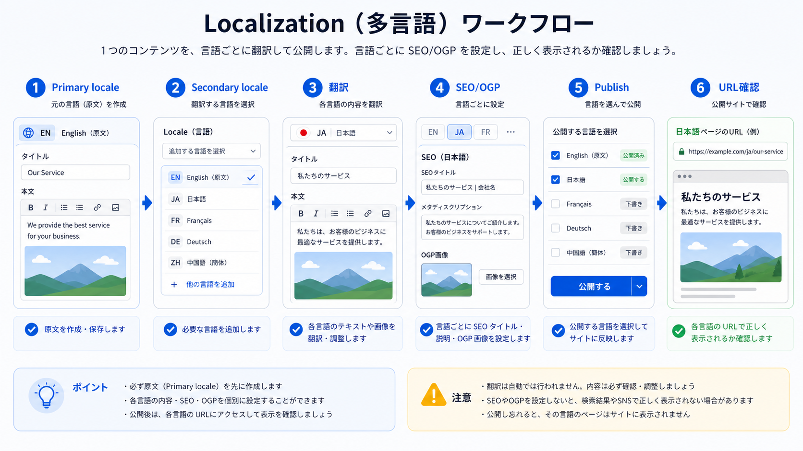

<!-- body-callout:start -->
:::tip[反映タイミングの目安]
Webflow上で保存しても、Google検索結果やSNSのプレビューはすぐに変わらないことがあります。Webflowの公開確認と、検索エンジンやSNS側の反映確認は分けて考えると混乱しにくくなります。
:::
<!-- body-callout:end -->

# E-6. LocaleごとのSEO・OGP確認

:::note[図解の見方]
各LocaleでSEO文言が自然か確認します。
:::

翻訳ページでは、本文だけでなくSEO項目もLocaleごとに確認します。本文が自然でも、SEO項目がPrimary localeのままだと、検索結果やSNS共有で不自然に見えます。
*実画面例: LocaleごとのSEOやOGPは、対象ページ・対象Localeを間違えずに確認します。*

## 確認する項目

| 項目 | 確認内容 |
| --- | --- |
| Page title | 検索結果で自然に見えるタイトルか |
| Meta description | クリックしたくなる説明になっているか |
| Slug | URLとして分かりやすいか |
| Open Graph title | SNSで共有された時に自然か |
| Open Graph description | SNS向けの説明文になっているか |
| OGP画像 | 言語・地域に合った画像か |
| Image alt | 画像の説明が対象言語で入っているか |

## SEO翻訳で気をつけること

- 日本語の直訳ではなく、対象言語で自然な検索語にする
- 会社名やサービス名を勝手に翻訳しない
- Slugを変更するとURLが変わるため慎重に扱う
- OGP画像に日本語文字が入っている場合、翻訳版画像が必要か確認する
- SNS共有時のタイトルと説明文もLocaleに合わせる

## Slug変更の注意

SlugはURLに影響します。公開済みページのSlugを変更すると、既存のリンクや検索結果からアクセスできなくなる可能性があります。

不安な場合は自己判断で変更せず、IGNITEへ相談してください。

## 次に進む

翻訳を公開サイトへ反映する流れは [Locale翻訳を公開サイトに反映する方法](/07-localization/07-publish-and-reflect-locale/) を確認してください。公開前の最終確認には [Locale公開前チェックリスト](/07-localization/05-locale-publish-checklist/) を使ってください。
