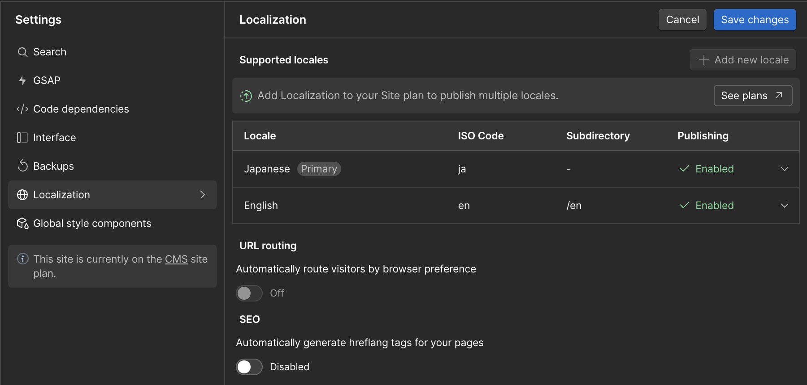
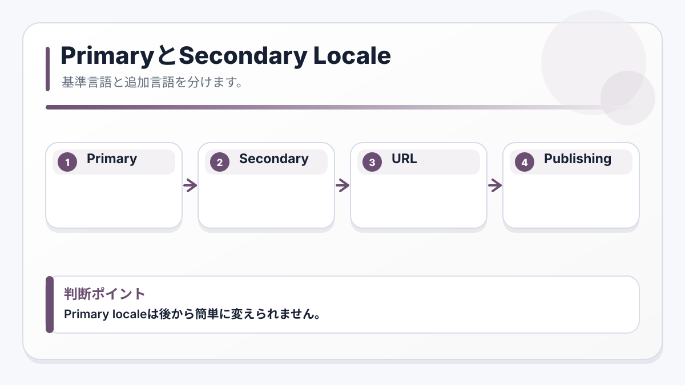

<!-- body-callout:start -->
:::caution[Locale確認]
翻訳作業では、今どのLocaleを編集しているかを最初に確認します。日本語、英語などのLocaleを間違えると、意図しない言語ページを書き換える可能性があります。
:::
<!-- body-callout:end -->

# E-3. 新しいLocaleを追加する時の流れ

:::note[図解の見方]
Primary localeは後から簡単に変えられません。
:::

新しいLocaleを追加すると、URL、公開範囲、言語切り替え、SEOに影響します。既存サイトで新しい言語を増やす場合は、自己判断で進めず、IGNITEまたは管理者に確認してから作業してください。

> <strong>注意</strong>: Webflowでは最初に作成したLocaleがPrimary localeになります。あとからSecondary localeをPrimary localeへ変更することはできません。
*実画面例: 新しいLocale追加はサイト全体に影響するため、事前にSite settingsや公開状態を確認します。*

## 追加前に決めること

| 項目 | 例 | 確認する理由 |
| --- | --- | --- |
| Language | English, Japanese | 翻訳する言語そのものを決めるため |
| Country | United States, Japan | 同じ英語でも地域別に分けるか判断するため |
| Display name | English, 日本語 | 公開サイトの言語切り替えに表示されるため |
| Subdirectory | `/en`, `/ja` | 公開URLに関わるため |
| Display image | 旗、言語アイコン | 言語切り替えUIに使う場合があるため |
| Publishing status | On / Off | すぐ公開するか、準備中にするか決めるため |

## 基本手順

1. Designerで対象サイトを開きます。
2. 上部バーのLocale selector、または左側のSettings panelからLocalizationを開きます。
3. Primary localeが正しいことを確認します。
4. Secondary localeを追加します。
5. Languageを選びます。
6. 必要に応じてCountryを選びます。
7. Display nameを確認します。
8. Subdirectoryを確認します。
9. Display imageを設定する場合は、言語切り替えで使う画像を登録します。
10. まだ公開しない場合は、Publishing statusをオフにしておきます。
11. Saveしてから、画面上部のSave changesを押します。

## Subdirectoryの注意

Subdirectoryは公開URLに関わる重要な設定です。例えば英語LocaleのSubdirectoryを `/en` にすると、公開後のURLは `https://example.com/en/...` のようになります。

やってはいけないこと:

- 既に使っているCMS Collection、フォルダ、ページと同じSlugを使う
- 公開済みURLを理由なく変更する
- SEOや広告で使っているURLを確認せず変更する
- Primary localeとSecondary localeのURL構造を混同する

> <strong>判断基準</strong>: URLが変わる可能性がある操作は、SEO、広告、既存リンク、QRコード、SNS投稿にも影響します。不安な場合は、作業前にIGNITEへ確認してください。

## Publishing statusの考え方

Secondary localeは、追加しただけでは公開準備が完了したとは限りません。翻訳が終わるまではPublishing statusをオフにし、翻訳・表示確認・SEO確認が終わってから公開します。

| 状態 | 使いどころ |
| --- | --- |
| Off | 翻訳作業中、確認中、まだ公開したくない時 |
| On | 公開してよい状態になり、Locale switcherにも出したい時 |

## 次に進む

Localeが用意できたら、固定ページは [静的ページをLocaleごとに翻訳する](/07-localization/02-static-page-translation/)、CMS記事は [CMS記事をLocaleごとに翻訳する](/07-localization/03-cms-locale-translation/) を確認してください。
