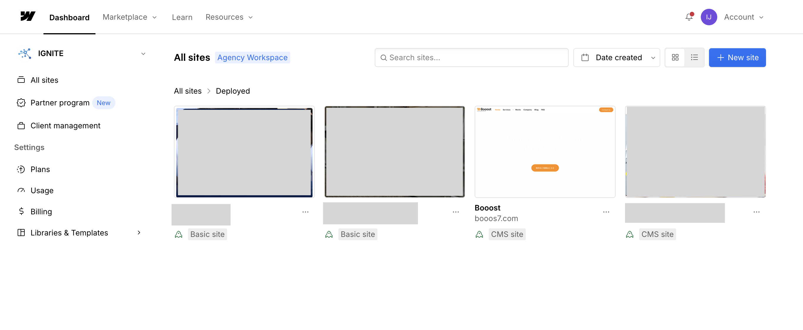

<!-- body-callout:start -->
:::tip[読み進め方]
初めて触る場合は、最初から順番に読むよりも「やりたい作業」に近い章を開き、先に [WORK-0. 作業前に確認すること](/work/06-before-start/) と公開前チェックだけ確認すると迷いにくくなります。
:::
<!-- body-callout:end -->

## このマニュアルについて

このマニュアルは、Webflow で構築されたサイトを <strong>非エンジニアのクライアント担当者</strong> が安全に更新できるよう、IGNITE が制作・公開している日本語の手順書です。Webflowの更新方法、Content Editorの使い方、CMS投稿、SEO設定、フォーム確認、Locale翻訳、トラブル解決まで全 7 カテゴリで網羅しています。
*実画面例: このマニュアルでは、Webflow Dashboardから対象サイトを開き、必要な画面へ進む流れを説明します。*

## やりたいことから探す

  <a class="manual-card" href="/work/06-before-start/"><strong>作業前に確認すること</strong>Workspace、サイト名、権限、Publish前の確認を先に整理します。</a>
  <a class="manual-card" href="/work/00-edit-text/"><strong>テキストを変えたい</strong>ページ上の文章を安全に直す流れを確認します。</a>
  <a class="manual-card" href="/work/01-replace-image/"><strong>画像を差し替えたい</strong>既存画像の交換、公開前チェック、相談ラインを確認します。</a>
  <a class="manual-card" href="/work/02-update-post/"><strong>お知らせ／ブログを更新したい</strong>CMSで記事を作成し、下書きから公開まで進めます。</a>
  <a class="manual-card" href="/work/03-edit-seo/"><strong>SEO設定を変えたい</strong>検索結果に出るタイトルや説明文を確認します。</a>
  <a class="manual-card" href="/work/04-check-forms/"><strong>フォーム送信内容を確認したい</strong>問い合わせ内容、CSV、通知メールの見方を確認します。</a>
  <a class="manual-card" href="/work/05-edit-locale/"><strong>言語切り替え（Locale）を直したい</strong>多言語ページの翻訳確認と公開前チェックへ進みます。</a>

## このマニュアルで分かること

- テキスト、画像、リンクなどの日常更新を安全に進める方法
- お知らせ／ブログ記事をCMSで作成し、下書き保存や公開を行う方法
- SEO設定、フォーム送信内容、通知メールなど運用で確認する場所
- Locale翻訳やDesigner操作など、影響範囲が大きい作業の注意点
- 反映されない、画像がアップロードできない、404になる時の確認方法

## 提供元と責任範囲

- <strong>提供元</strong>: IGNITE
- <strong>対象</strong>: IGNITEが制作・運用支援するWebflowサイトの更新担当者、およびWebflow更新手順を確認したい一般読者
- <strong>内容</strong>: Webflow公式情報を参照し、クライアント運用で安全に使える範囲に絞って日本語化・手順化したもの
- <strong>注意</strong>: Webflowの画面やプラン、権限名は変更される場合があります。契約、請求、DNS、サイト構造変更など影響が大きい操作は、必ず自社の管理者、または [IGNITE公式サイトのお問い合わせフォーム](https://igni7e.jp/contact/) から確認してください。

## まず読むページ

- [A-0. Webflowの構造を知る](/01-getting-started/00-workspace-intro/)
- [A-0-6. プラン・権限で迷ったときの見方](/01-getting-started/00-plan-role-decision/)
- [A-1. 更新作業の全体像](/01-getting-started/00-site-update-overview/)
- [A-10. Webflow日本語化拡張機能とChrome翻訳](/01-getting-started/09-chrome-translate-webflow/)
- [A-11. Webflow基本用語の早見表](/01-getting-started/10-webflow-ui-glossary/)
- [B-1. Content Editor入門](/02-editor/00-editor-complete-guide/)
- [B-2. Content Editor（最新）でWebflowを開く手順](/02-editor/02-open-content-editor/)
- [B-13. 最新Content Editor画面の見方](/02-editor/13-latest-content-editor-screen-guide/)
- [C-1. ブログ記事を新規投稿する完全ガイド](/03-cms/00-blog-post-complete-guide/)
- [C-27. Booost記事入力フィールド早見表](/03-cms/26-booost-cms-field-guide/)
- [D-2. Designerの注意点](/04-designer/01-designer-warning/)
- [E-1. Locale翻訳の全体像](/07-localization/00-localization-overview/)
- [F-1. フォーム回答・CSV・SEO設定](/05-settings/00-site-settings-complete-guide/)
- [G-1. トラブル時にまず確認するチェックリスト](/06-troubleshooting/00-common-checklist/)

## 細かい手順を探す

- Webflowへの招待やログイン、ダッシュボードについての知識が必要ですか？ → [A-2. Webflowからの招待メールを確認しよう](/01-getting-started/01-invitation-email/) から順番に確認してください。
- プラン、権限、メンバー追加の違いで迷っていますか？ → [A-0-6. プラン・権限で迷ったときの見方](/01-getting-started/00-plan-role-decision/) を確認してください。
- Webflowの英語UIが不安ですか？ → [A-10. Webflow日本語化拡張機能とChrome翻訳](/01-getting-started/09-chrome-translate-webflow/) と [A-11. Webflow基本用語の早見表](/01-getting-started/10-webflow-ui-glossary/) を先に確認してください。
- 普段の文字・画像・リンク更新をしたいですか？ → [B-2. Content Editor（最新）でWebflowを開く手順](/02-editor/02-open-content-editor/) を使います。
- 最新版Content Editorの画面で何を見ればよいか迷っていますか？ → [B-13. 最新Content Editor画面の見方](/02-editor/13-latest-content-editor-screen-guide/) を確認してください。
- ブログやお知らせの投稿をしたいですか？ → [C-2. CMS更新](/03-cms/01-where-is-cms/) と [C-27. Booost記事入力フィールド早見表](/03-cms/26-booost-cms-field-guide/) を確認してください。
- DesignerモードでレイアウトやCSSに触る必要がありますか？ → 先に [D-2. Designerの注意点](/04-designer/01-designer-warning/) を読んでください。
- WebflowのLocale機能で翻訳を追加・修正したいですか？ → [E-1. Locale翻訳](/07-localization/00-localization-overview/) を確認してください。

## 困ったときは

各章末の「よくある質問」セクションを確認しても解決しない場合は、まず [自分で直すより任せたい時のWebflow保守・補修依頼](/06-troubleshooting/07-maintenance-request/) を確認してください。

> <strong>保守契約済みの方</strong>: すでにIGNITEと保守契約を結んでいる場合は、問い合わせフォームではなく、通常の保守連絡としてGoogle Chat、または担当者へ直接ご連絡ください。

> <strong>未契約・新規相談の方</strong>: まだ保守契約がない場合や、初めて相談する場合は [IGNITE公式サイトのお問い合わせフォーム](https://igni7e.jp/contact/) からご連絡ください。

> <strong>ヒント</strong>: 何か変更を加える前に、ブラウザで <strong>新しいタブ</strong> にサイトを開いておくと、変更前後を見比べやすいです。
