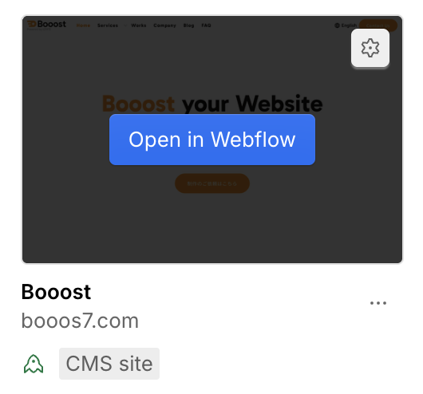
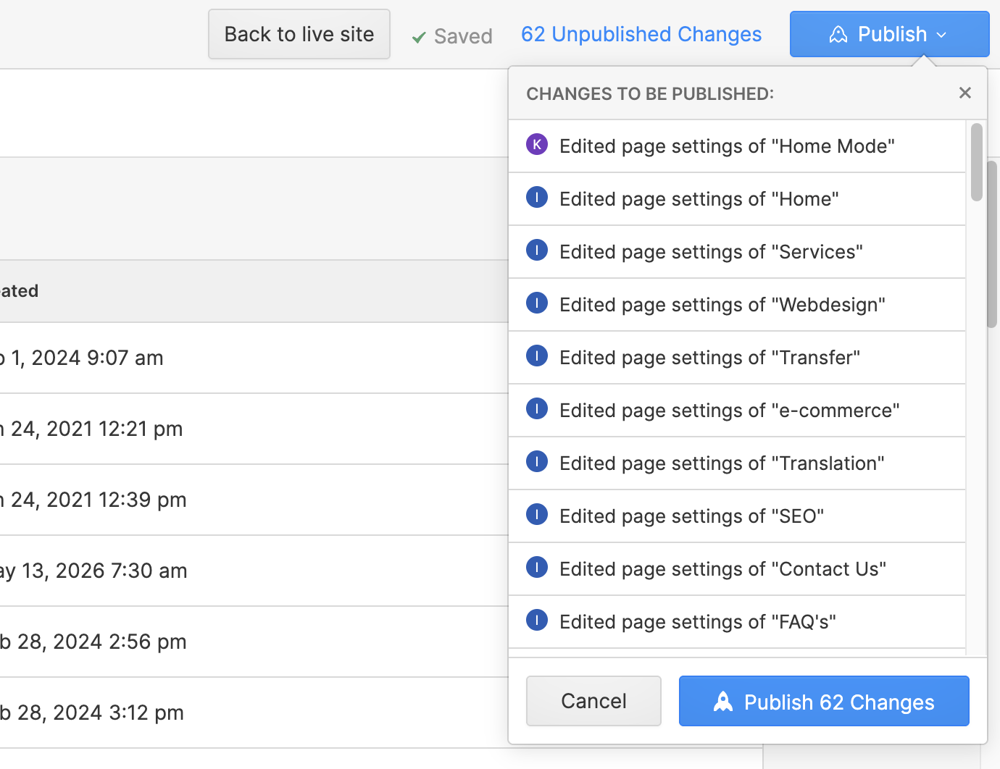
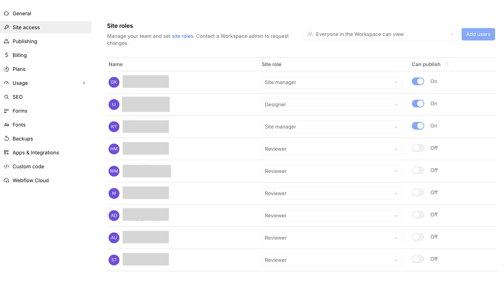

# WORK-1. テキストを変えたい

## こんなときに使います

会社情報、サービス説明、ボタン周辺の短い文章など、既存ページに表示されているテキストを修正したい時に使います。

日常的な文章修正は、まずContent editor roleで作業することをお勧めします。

## 必要な準備

- Webflowにログインできるアカウント
- 修正後の文章
- 修正対象ページのURL
- 作業前チェック: [WORK-0. 作業前に確認すること](/work/06-before-start/)
- 参考ページ: [B-2. Content Editor（最新）でWebflowを開く方法](/02-editor/02-open-content-editor/)
- 画面の見方: [B-13. 最新Content Editor画面の見方](/02-editor/13-latest-content-editor-screen-guide/)

## 手順

1. Dashboardから対象サイトを開きます。

2. 修正したいページを表示します。
3. 変更したい文章にカーソルを合わせ、編集できる状態か確認します。

4. 編集アイコンまたはテキスト部分をクリックします。
5. 文章を入力・削除します。
6. 誤字脱字と改行位置を確認します。
7. スマートフォン表示でも崩れていないか確認します。
8. 問題がなければPublishします。

:::tip[長い文章の更新]
長い文章は、先にGoogle Docsやメモ帳で作ってから貼り付けることをお勧めします。直接入力だけで進めると、途中で内容を見失いやすくなります。
:::

## つまずきポイント FAQ

### Q. クリックしても文章を編集できません

まずContent editor roleで開いているか、修正したい文字に青い枠や鉛筆アイコンが出るかを確認してください。表示が出ない場合は、その文字がCMSやDesigner側で管理されている可能性があります。

権限が原因の場合は、Site settingsのSite accessまたはMembersで、自分のSite roleが `Content editor` 以上になっているか、Publishまで必要な場合は `Can publish` がオンになっているかを確認します。詳しくは [エディターでサイトの文字を書き換える方法](/02-editor/03-edit-text/) と [Webflowの共同編集者を招待する](/05-settings/08-invite-collaborator/) を確認してください。

### Q. 文章を変えたのに公開サイトに出ません

Publishが完了しているか、ブラウザキャッシュが残っていないかを確認してください。

### Q. レイアウトが崩れそうで不安です

公開前にスクリーンショットを撮り、変更前後を見比べてから進めることをお勧めします。
