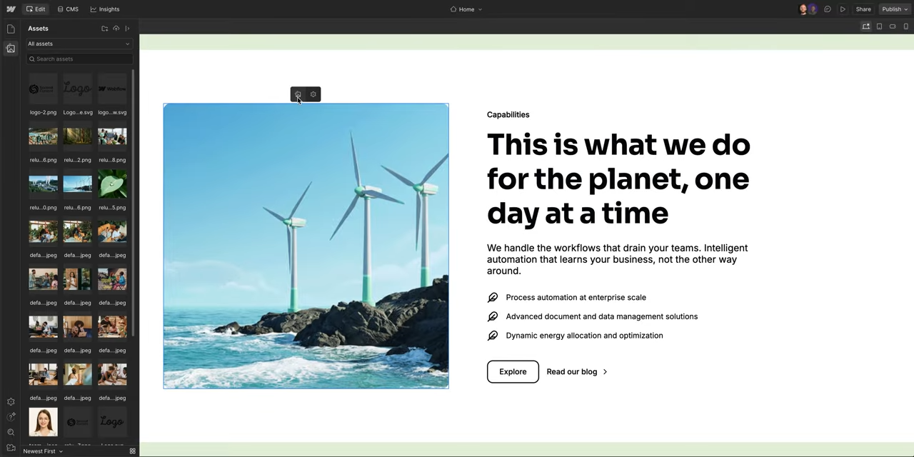

## こんなときに使います

既存ページの写真、バナー、アイキャッチ画像などを新しい画像に差し替えたい時に使います。

画像は見た目への影響が大きいため、公開前にサイズ、縦横比、表示位置を確認しましょう。

## 必要な準備

- 差し替える画像ファイル
- 画像の使用許可
- 修正対象ページのURL
- 作業前チェック: [WORK-0. 作業前に確認すること](/work/06-before-start/)
- 参考ページ: [エディターで画像を差し替える方法](/02-editor/06-replace-image/)
- 画面の見方: [B-13. 最新Content Editor画面の見方](/02-editor/13-latest-content-editor-screen-guide/)

## 手順

1. Content editor roleで対象ページを開きます。
2. 差し替えたい画像にカーソルを合わせます。
3. 画像編集アイコンをクリックします。

4. 新しい画像をアップロードします。
5. 画像が粗くないか確認します。
6. 縦横比が崩れていないか確認します。
7. スマートフォン表示で見切れていないか確認します。
8. 問題がなければPublishします。

:::caution[画像の権利]
外部サイトやSNSから保存した画像は、そのまま使えない場合があります。使用許可がある画像か確認してからアップロードしてください。
:::

## つまずきポイント FAQ

### Q. 画像がアップロードできません

ファイル形式、容量、通信状態を確認してください。詳しくは [画像アップロードのトラブル](/06-troubleshooting/02-image-upload-failed/) を確認してください。

### Q. 画像が横に伸びて見えます

元画像の縦横比が合っていない可能性があります。既存画像と近い比率の画像を用意することをお勧めします。

### Q. どの画像を差し替えたか分からなくなりました

作業前に対象ページと画像周辺をスクリーンショットで残しておきましょう。
