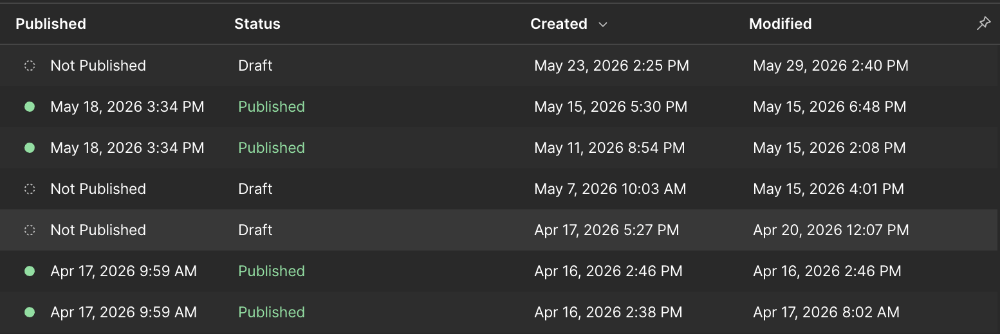

## こんなときに使います

新しいお知らせやブログ記事を追加したい時、既存記事の本文・カテゴリー・公開日を直したい時に使います。

CMSは「決まった項目に入力して記事を作る場所」です。ページのデザインを直接変える場所ではありません。

## 必要な準備

- 記事タイトル
- 本文原稿
- アイキャッチ画像
- カテゴリー
- 公開日
- 作業前チェック: [WORK-0. 作業前に確認すること](/work/06-before-start/)
- 入力欄の確認: [C-27. Booost記事入力フィールド早見表](/03-cms/26-booost-cms-field-guide/)
- 参考ページ: [C-1. ブログ記事を新規投稿する完全ガイド](/03-cms/00-blog-post-complete-guide/)
- 画面の見方: [B-13. 最新Content Editor画面の見方](/02-editor/13-latest-content-editor-screen-guide/)

## 手順

1. Content editor roleでWebflowを開きます。
2. CMSの入口を開きます。
3. 対象のCMS一覧を選びます。
4. `New` または既存記事を開きます。

:::note[キャプチャー指示]
CMS Collections（Blog）の記事一覧が画面全体で見える状態を撮影してください。保存ファイル名は `src/assets/captures/manual/work-02-cms-items-full-list.png`。撮影直前の状態は、Blog CollectionのItems一覧を開き、テーブルの見出し・記事行・左メニューが表示されている状態です。Loading、スピナー、個人情報、未公開の詳細本文は写さないでください。
:::

5. タイトル、Slug、本文、画像、カテゴリーを入力します。
6. 下書き保存して内容を確認します。
7. 一覧ページと詳細ページの見え方を確認します。
8. 問題がなければPublishします。

:::tip[下書き確認]
いきなり公開せず、まず下書きで保存してタイトル、本文、画像、リンクを確認することをお勧めします。
:::

## つまずきポイント FAQ

### Q. CMSがどこにあるか分かりません

[「お知らせ」や「ブログ」はどこで管理してるの？](/03-cms/01-where-is-cms/) を確認してください。

### Q. カテゴリーが選べません

カテゴリー用のFieldがあるか、選択肢が開いているかを確認してください。

### Q. SummaryやSlugなど、どこに何を入れるか分かりません

[Booost記事入力フィールド早見表](/03-cms/26-booost-cms-field-guide/) を確認してください。

### Q. 公開前に何を確認すればよいですか

[CMS記事の公開前チェックリスト](/03-cms/25-cms-before-publish-checklist/) を使って確認しましょう。
