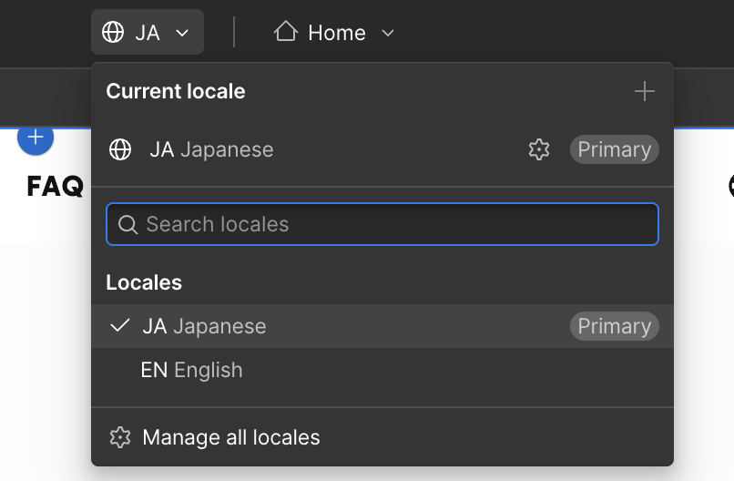

# WORK-6. 言語切り替え（Locale）を直したい

## こんなときに使います

日本語・英語などの多言語ページで、翻訳文、LocaleごとのSEO、公開状態を確認したい時に使います。

LocaleはページやCMS記事ごとに状態が分かれるため、修正対象の言語を間違えないように確認しましょう。

## 必要な準備

- 修正したい言語
- 修正対象ページまたはCMS記事
- 翻訳後の文章
- 作業前チェック: [WORK-0. 作業前に確認すること](/work/06-before-start/)
- 参考ページ: [E-1. Locale翻訳の全体像](/07-localization/00-localization-overview/)

## 手順

1. DesignerまたはLocalization関連画面を開きます。
2. 現在選択しているLocaleを確認します。
3. 修正したいLocaleへ切り替えます。

4. 翻訳文を確認します。
5. 必要な文章だけ修正します。
6. CMS記事の場合はCMS側のLocale項目も確認します。
7. SEO titleやOGPがLocaleごとに正しいか確認します。
8. 公開前チェックを行ってからPublishします。

:::caution[Localeの確認]
日本語ページを直しているつもりで英語Localeを編集するなど、対象言語の取り違えが起きやすい作業です。編集前後にLocale selectorを確認することをお勧めします。
:::

## つまずきポイント FAQ

### Q. 固定ページの翻訳を直したいです

[静的ページをLocaleごとに翻訳する](/07-localization/02-static-page-translation/) を確認してください。

### Q. CMS記事の翻訳を直したいです

[CMS記事をLocaleごとに翻訳する](/07-localization/03-cms-locale-translation/) を確認してください。

### Q. 公開前に何を確認すればよいですか

[Locale公開前チェックリスト](/07-localization/05-locale-publish-checklist/) を確認してください。
